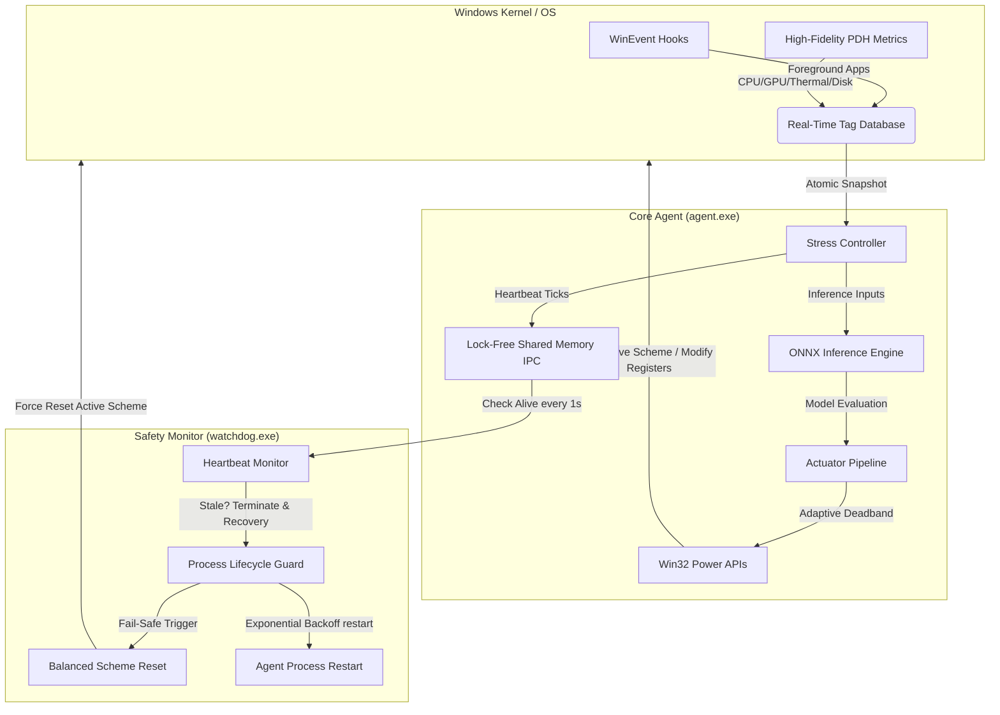

# 🛡️ WinSCADA Power Agent (WSPA)

[](https://github.com/geminipro123pakistan-ctrl/WinSCADA/actions/workflows/build.yml)
[](https://opensource.org/licenses/MIT)
[](https://microsoft.com/windows)

An intelligent, ultra-low-latency background optimization agent designed for Windows. Operating like an industrial Supervisory Control and Data Acquisition (SCADA) system, it dynamically balances system responsiveness and battery longevity by intercepting OS events, evaluating state telemetry via an embedded ONNX machine learning model, and tuning hardware power registers via native Win32 APIs.

---

## 🏛️ System Architecture

The architecture is built on elite systems engineering principles: it completely decouples telemetry ingestion (Sensors) from system tuning (Actuators) using an in-memory, **lock-free, zero-allocation Real-Time Tag Database**. A highly deterministic AI-assisted control loop drives inference, wrapped securely inside an independent system watchdog.



### ⚡ Performance Benchmarks
WSPA is engineered for ultra-low latency and minimal scheduler wakeups. The core control path is completely zero-allocation (`std::array` + `std::atomic`).
- **Telemetry Ingestion (`TagDatabase::set`)**: ~14.8 ns/op
- **Dirty-State Evaluation (`Controller::evaluate`)**: ~24.0 ns/op
- **Mutex Contention**: 0 (Fully Lock-Free)
- **Heap Allocations in Hot Path**: 0

*Benchmarks recorded on Windows 11 (Intel P/E Hybrid Topology) running 1,000,000 continuous operations.*

---

## 🛠️ Core Functional Components

### 1. Sensor & Telemetry Layer (Hybrid Lanes)
* **The Interrupt Lane (Event-Driven):** Uses native Win32 `SetWinEventHook` to listen for foreground changes.
* **The Coalesced Lane (Time-Series Data):** Captures high-fidelity metrics via PDH.
    - **CPU/GPU/Disk:** Deep hardware utilization metrics.
    - **Thermal:** Auto-detects Kelvin/Celsius units to monitor `Thermal Zone Information`.
    - **Timer Pollution:** Monitors system-wide `NtQueryTimerResolution` requests.

### 2. Controller Layer (The AI Loop)
* **Deterministic Cadence:** The control loop interval scales gracefully between **50ms and 500ms** based on system stress (SSS), ensuring fast response during load and deep sleep during idle.
* **Security & Integrity:** The agent verifies the ONNX model's SHA-256 integrity using native Win32 BCrypt before loading.
* **Power Requests:** Protects inference cadence from kernel throttling using Win32 `PowerSetRequest`.
* **Telemetry Log Rotation:** Automatically shifts telemetry CSV logs (telemetry_log_N.csv) up to a maximum number of files when size thresholds are reached to preserve disk space.

### 3. Actuator Layer (Zero-Allocation Pipeline)
* **Batched Writes:** Changes are queued in lock-free arrays and applied in a single batch to prevent kernel-level thrashing.
* **Adaptive Deadband:** Filters output jitter using multi-stage sensitivity thresholds.
* **Persistence:** Correctly negotiates scheme re-activation using strict GUID lifecycle management and dynamic schema duplication.

### 4. Safety & Recovery Layer (The Watchdog)
* **Mutual Heartbeat Monitoring:** The watchdog process polls a lock-free named shared memory section (`Local\WinSCADA_Heartbeat`) updated by the agent. If the agent hangs (ticks stop advancing for 5 seconds), it is immediately terminated and recovered.
* **Industrial Safe State Assertion:** The watchdog asserts the standard `Balanced` power scheme as a known-safe baseline upon agent crash/hang.
* **Exponential Backoff:** Ensures cyclic failure resilience before attempting system recovery.

---

## ⚙️ Configuration (`wspa_config.ini`)

All system variables are runtime-configurable via a lightweight `wspa_config.ini` placed in the executable directory. If not present, WSPA automatically falls back to hardened compile-time defaults.

### Reference Settings Table

| Section | Parameter | Default | Description |
| :--- | :--- | :--- | :--- |
| `[general]` | `log_level` | `INFO` | Logging level. Options: `TRACE`, `DEBUG`, `INFO`, `WARN`, `ERROR`, `FATAL`. |
| `[general]` | `data_collection` | `false` | Enable/disable telemetry CSV recording for future model training. |
| `[general]` | `model_path` | `models/power_model.onnx` | Relative path to the ONNX model binary. |
| `[general]` | `telemetry_log_path` | `models/telemetry_log.csv` | Filepath for logging collected telemetry records. |
| `[controller]`| `min_control_loop_interval_ms` | `50` | Lower bound of the AI control cadence loop. |
| `[controller]`| `max_control_loop_interval_ms` | `500` | Upper bound of the AI control cadence loop. |
| `[controller]`| `telemetry_interval_ms` | `1000` | Telemetry gathering cycle cadence. |
| `[controller]`| `dirty_flag_epsilon` | `1.0` | Threshold percentage change to trigger actuation updates. |
| `[deadband]` | `high_stress` | `1.0` | Actuator deadband threshold under load (%). |
| `[deadband]` | `medium_stress` | `5.0` | Actuator deadband threshold under moderate stress (%). |
| `[deadband]` | `low_stress` | `10.0` | Actuator deadband threshold when idle (%). |
| `[stress_weights]` | `cpu`, `queue`, `thermal`, `gpu`, `disk` | `0.30`, `0.40`, `0.10`, `0.10`, `0.10` | Ingestion weights for SSS calculation (Must sum to 1.0). |
| `[governor]` | `exclusion_list` | *(Standard Win32 processes)* | Comma-separated process names excluded from CPU E-core scheduling. |
| `[governor]` | `governor_interval_ms` | `5000` | Core governor optimization cycle cadence. |
| `[watchdog]` | `max_recovery_attempts` | `3` | Maximum recovery restarts before watchdog safely exits. |
| `[telemetry_rotation]` | `max_file_size_mb` | `50` | Max telemetry file size in MB before initiating shift rotation. |
| `[telemetry_rotation]` | `max_rotated_files` | `5` | Maximum number of rotated files to retain. |

---

## 🚀 Getting Started

### 📦 Prerequisites
* Windows 10 / 11 (x64)
* CMake (v3.20+) & MSVC (VS 2022)
* [Optional] `vcpkg` for ONNX Runtime library dependency tracking.

### 🔨 Build & Validate
To compile and test without local ONNX Runtime dependencies (disabled AI mode):
```powershell
cmake -B build -DWSPA_DISABLE_AI=ON
cmake --build build --config Release
```

To run build-in CTest gates:
```powershell
ctest --test-dir build --output-on-failure
```

### 🏃 Running WSPA
Start WSPA by launching the watchdog to monitor the agent process:
```powershell
.\build\src\watchdog\Release\watchdog.exe .\build\src\agent\Release\agent.exe
```

---

## 🧹 Uninstalling

WSPA includes a built-in clean uninstallation script to restore the host system to default settings and wipe telemetry files.

Run the uninstaller via PowerShell (requires Elevation):
```powershell
Powershell.exe -ExecutionPolicy Bypass -File .\scripts\uninstall.ps1
```

This script will automatically:
1. Safely stop the running `agent` and `watchdog` processes.
2. Revert the active Windows power scheme to the system default `Balanced` scheme.
3. Cleanly delete the `WinSCADA AI Optimized` power scheme from the OS.
4. Purge all telemetry logs and rotated files.

---

## 📜 License
MIT License. Copyright 2026 WinSCADA Contributors.
